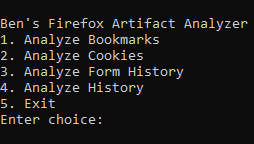
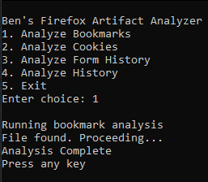

# Firefox Artifact Analyzer

This project started as a small digital forensics experiment. I initially created simple scripts to extract browsing history and form history from Firefox `.sqlite` files. From there, I attempted to build a full CLI forensic toolkit, but it turned out to be just too big for me, for now.

I decided to refocus on the earlier browser scripts and combine them into a **Firefox Artifact Analyzer**.

The tool provides a simple CLI menu that allows you to choose from:

- Analyze Bookmarks
- Analyze Cookies
- Analyze Form History
- Analyze History

Based on your selection, the script queries the corresponding Firefox databases to extract the requested data and writes the results to a CSV file.

## Screenshots
**Menu:**

**CSV Example Output**

