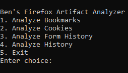
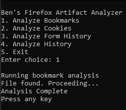
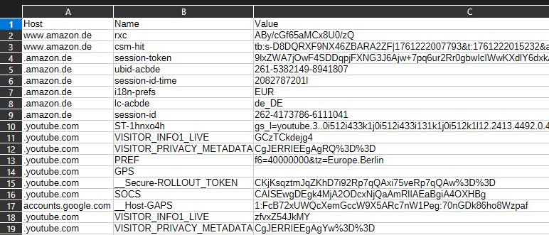

# Firefox Artifact Analyzer

Dieses Projekt begann als kleines Experiment im Bereich der digitalen Forensik. Zuerst habe ich einfache Skripte erstellt, um den Browserverlauf und die Formulardaten aus den Firefox `.sqlite` Dateien auszulesen. Danach habe ich versucht, ein vollständiges CLI-Forensik-Toolkit zu erstellen, aber das war einfach zu umfangreich für mich.

Ich habe mich entschieden, mich wieder auf die ursprünglichen Browser-Skripte zu konzentrieren und sie in einem **Firefox Artifact Analyzer** zusammenzuführen.

Das Tool bietet ein einfaches CLI-Menü, in dem man folgendes auswählen kann:

- Analyze Bookmarks
- Analyze Cookies
- Analyze Form History
- Analyze History

Abhängig von der Auswahl fragt das Skript die entsprechenden Firefox-Datenbanken ab, extrahiert die gewünschten Daten und schreibt die Ergebnisse in eine CSV-Datei.

## Screenshots
**Menü:**

**CSV Beispiel-Ausgabe:**

